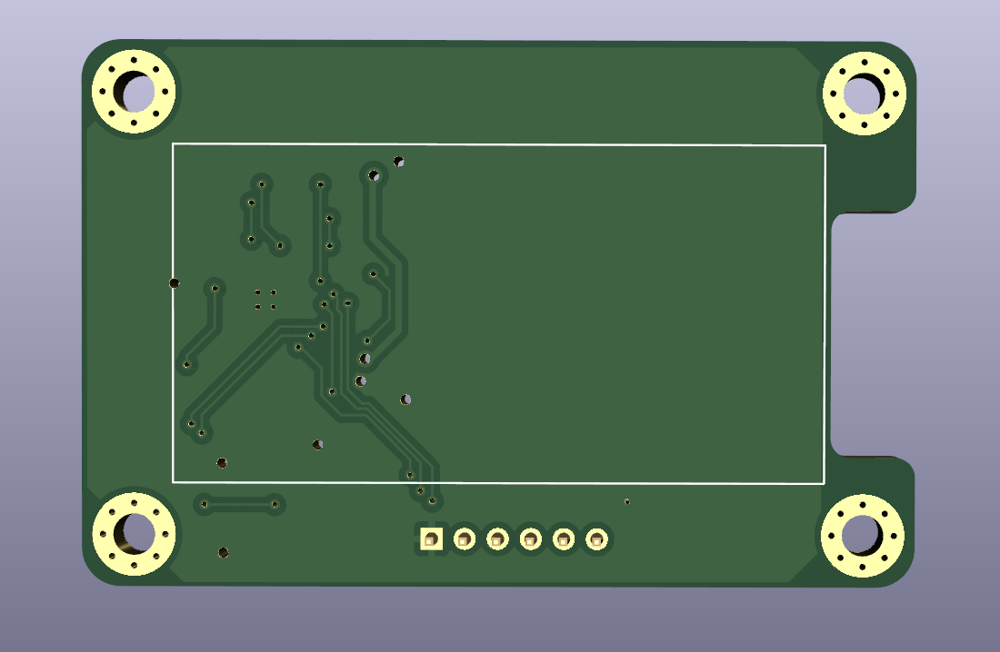
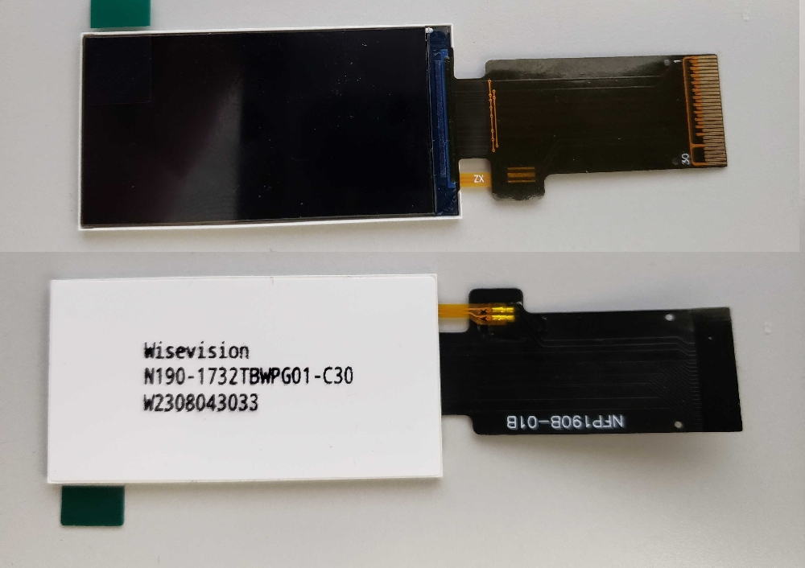
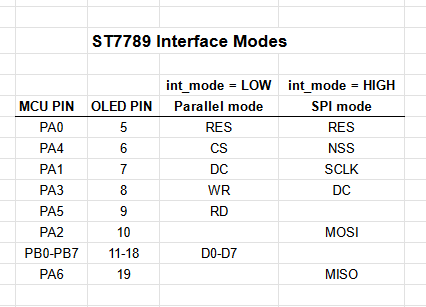

# bitaxe-OLED
bitaxe-OLED is a carrier board for a specific 1.9 inch 170x320 OLED
which is intended to connect to a bitaxe device via the BAP (Bitaxe Accessory Port)

Here is the OLED display

The display attaches to the front of the carrier board using double sided foam tape, and 
the connector wraps around through the notch and attaches to the 30-pin connector on the back.

This OLED display uses a ST7789 controller and can operate in parallel mode or SPI mode
through its 30-pin connector.  The carrier board uses an STM32 MCU to drive the OLED 
and the hardware is designed to support either parallel or SPI mode, depending on the 
needs of the firmware developer.

The pins used to support each interface are described in this table

